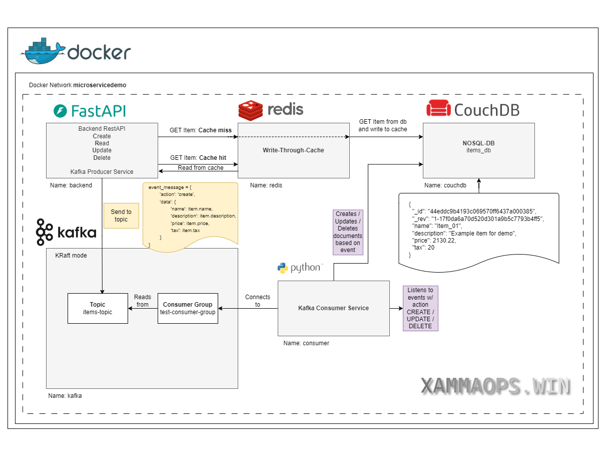

# Microservice Demo

***A demo for working with microservices in an event-driven approach.***  

Contains a backend **RestAPI written with FastAPI**, a **couchDB No-SQL Database** , **Redis cache** and a **Kafka Pub-Sub**.  
The API will act as the producer and sent events to a Kafka topic, when an item is created, updated or deleted.  
The database consumer service will watch this topic and apply the according logic to the database.  

For read intensive stuff I've added an redis cache (write-through) to get load off the database.  
So every time there is a read miss on the cache, the cache will be immediately written with the data from the database.  



## Preqrequisites
- mise installed for easy setup (can also run everything one by one)
- Some knowledge of Docker
- If u want to run this on K8s: A working Kubernetes cluster with an Apache Kafka (if you want to use Kafka, which kinda is the point of this demo) and Redis/dragonflydb

## How to run
You need to have docker and python installed.  
This app can be run with or without Kafka.  

### Without Kafka locally (DB + redis only)

```
mise setuplocaldbonly
```

Redis stuff:
```
docker exec -it redis sh
redis-cli
SELECT 5
127.0.0.1:6379[5]> KEYS "item:*"
1) "item:823787279bb2af999f42f2852b0001f0"

127.0.0.1:6379[5]> GET item:823787279bb2af999f42f2852b0001f0
"{\"name\":\"Feierabend\",\"description\":\"wie das duftet!\",\"price\":66.66,\"tax\":null,\"id\":\"823787279bb2af999f42f2852b0001f0\"}"
```

### With Kafka (fullstack)

```
mise setupfullstack
```

Kafka commands:
```
# exec into the container
docker exec -it kafka bash
cd /opt/kafka/bin

# List topics
d55dc7950eb5:/opt/kafka/bin$ ./kafka-topics.sh --bootstrap-server kafka:9092 --list
items-topic

# List all items in topic
./kafka-console-consumer.sh --bootstrap-server kafka:9092 --topic items-topic --from-beginning --partition 0
```

## Tools

```
http://localhost:8080/docs
http://127.0.0.1:5984/_utils
docker logs <containername>
docker exec -it <containername> sh
```

## Shutdown and remove resources

```
mise teardown
```

## How to run on Kubernetes
Simple setup, the secret would ofc be an externalSecret if using this on Prod and pulled from a SecretStore.  
Make sure a Kafka cluster, Redis and CouchDB is running on K8s to make this work.  
```
kustomize build k8s-manifests/ | k apply -n demodeploy -f -
```

## Notes
The Dockerfile is not best-practice, I usually would use a distroless nonroot image to run the app but for demo purposes and looking inside the container I chose this approach..  